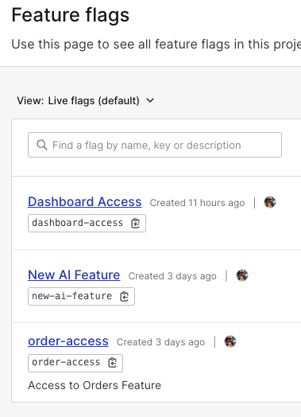
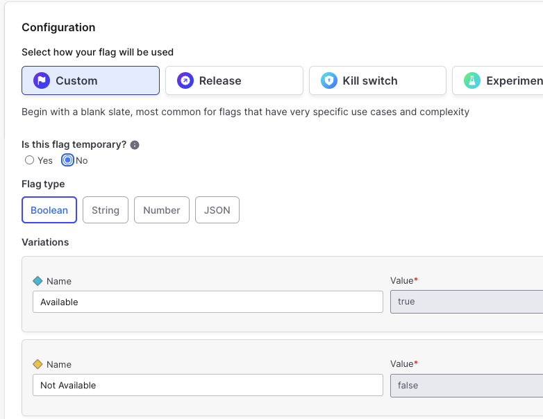
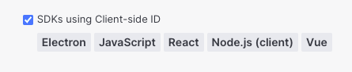
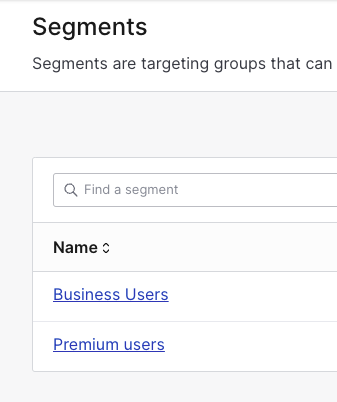
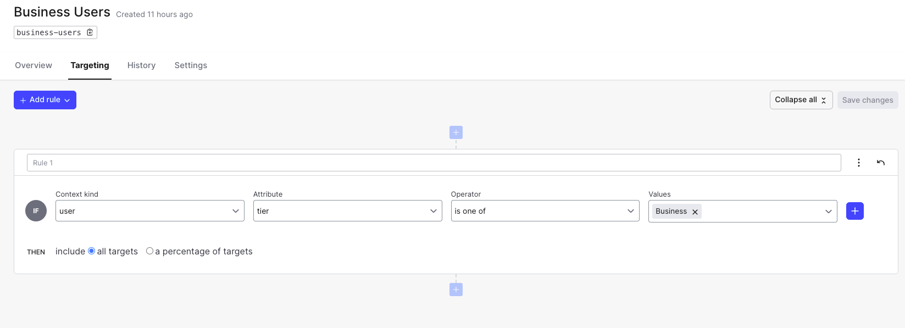
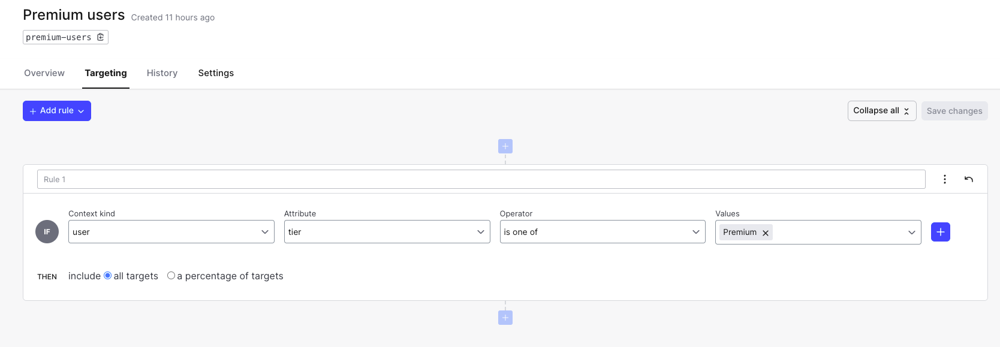
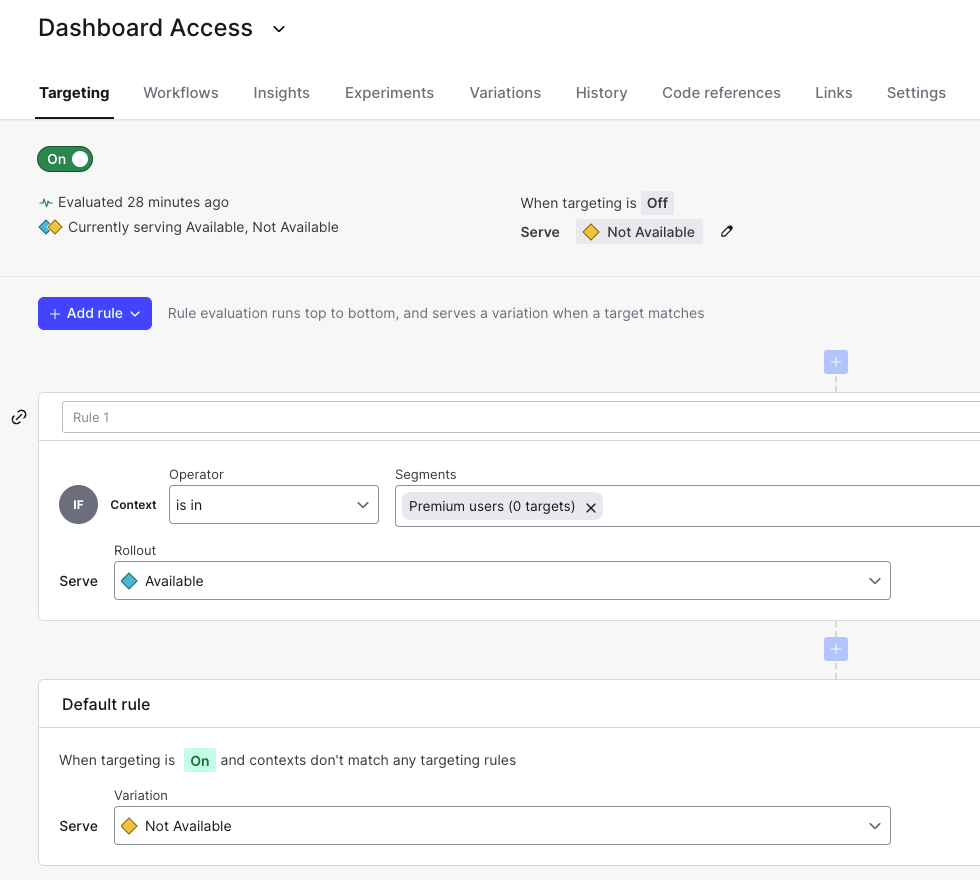
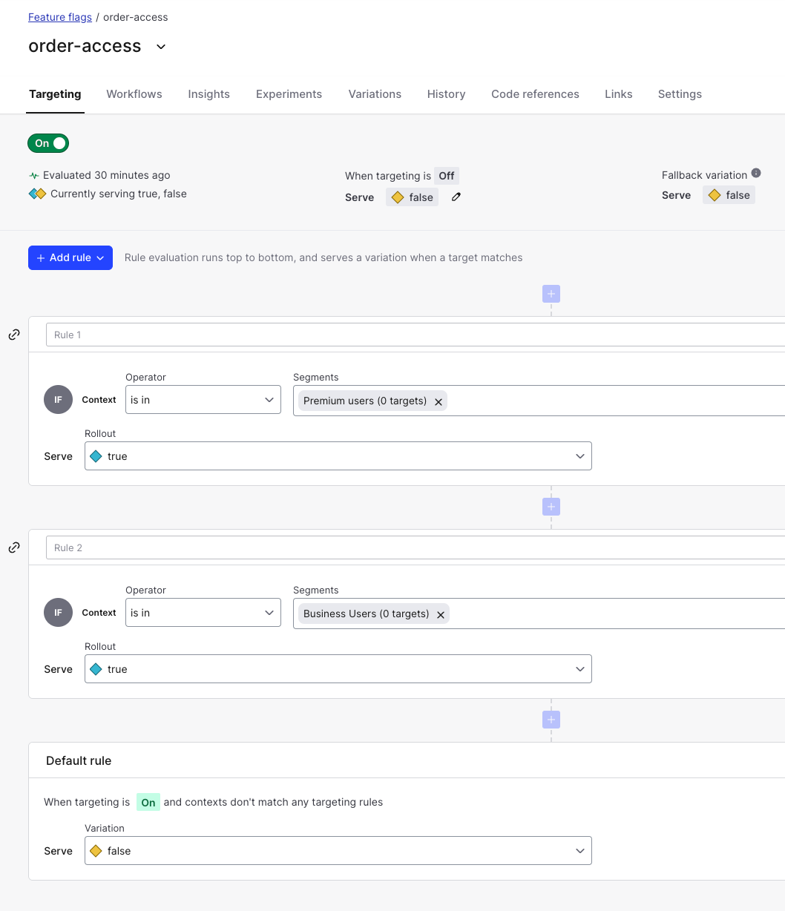
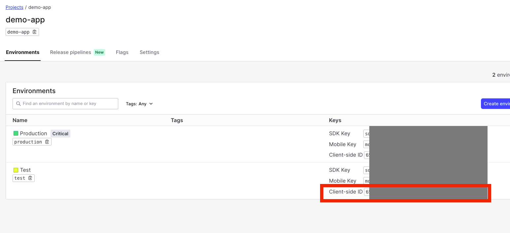
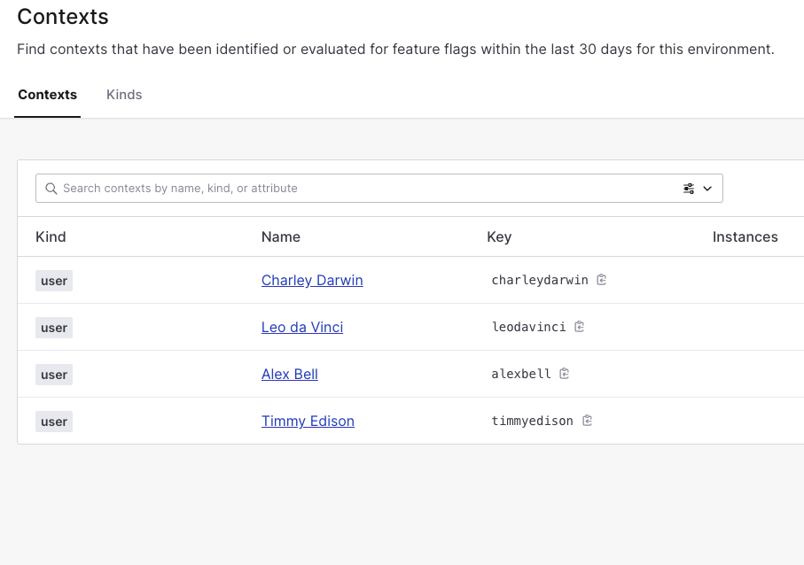

# Application Access Tiers Demo App

This is a demo app for using LaunchDarkly flags to grant user access for different subscription tiers

A live demo can be found here: https://main--ld-demo-app.netlify.app/
## Setup and Deploy Instructions

### LaunchDarkly setup
1) Start a LaunchDarkly free trial account
2) create the following three flags



with the following settings for all three


Be sure to check "SDKs using Client-side ID" on each of them



3) Add the following Segments







4) Back to the Feature Flags - Configure targeting for order-access and dashboard-access





## Installation

Clone the repo

```bash
cd ld-demo-app
npm install
```
Make a copy of .env.example to .env.local.  
Get your Client-side ID from LaunchDarkly and populate REACT_APP_LD_CLIENT_ID in env file.

Account Settings | Projects | [Project] | Environments


```bash
npm run start
```

## Usage

Four static users have been added for demo purposes.  These can be found in the src/demo_data.json

Application Access
- Home & Products - All users can access these
- Orders - Business and Premium users can access this page
- Dashboard - only Premium users can access this page
- AI - This is a beta feature that hasn't been released yet.  
Allow access to this page using the LaunchDarkly UI by toggling the New AI Feature in the LaunchDarkly dashboard.


When the app initializes, the context is set with a default user on a Free Tier.
CHANGE USER on the right side of the nav bar can be used to change between different users.
This uses ldClient.identify() to change the context of the app to a different user.
This will also add new context in LaunchDarkly that do not already exist.
As you change between users, access to the pages will change, and additional context users should appear in your LaunchDarkly dashboard.



## License

[MIT](https://choosealicense.com/licenses/mit/)